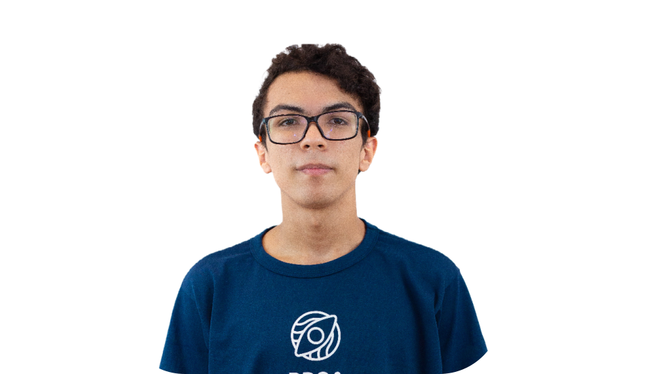

<h1 align="center"> Fundação T&C </h1>

    

    

 
 

<!--Sobre nós-->

    <h2 align="center"> :wave: Sobre nós</h2>
    
    

        
 Existem mil e um motivos para professores não terem espaço no mercado de trabalho, mas um
            deles é o preconceito.
            O cenário tem melhorado quando olhamos para números generalizados, mas quando observamos outros grupos
            sociais marginalizados como indígenas, mulheres negras e a população LGBTQIA+ não-normativos, há ainda muito
            preconceito na oferta e na conquista de vagas. Por isso, decidimos criar nossa plataforma como uma
            solução! 
             
            A <b>Fundação T&C</b> surgiu com o intuito de ser uma ferramenta para o aprendizado e formação de jovens
            adultos na área da tecnologia, e uma porta para professores terem visibilidade no mercado de trabalho.
            Acreditamos no poder do conhecimento e da educação em uma sociedade, e queremos que a tecnologia ganhe cada
            vez mais espaço no processo educacional. Venha fazer parte da mudança de hoje que garante o futuro brilhante
            do nosso amanhã!!
        

    

 
 

<!--Nossa equipe -->

    

        <h2 align="center"> :woman_technologist: Nossa equipe </h2>
        <!--Linha 1-->
        

            
            
            
            
        

    

     
    <!--Linha 2-->
    

        

            
            
            
        

    

    <h2 align="center"> 👨🏾‍💻 Tecnologias que utilizamos</h2>
	 
   	

	  <h3> :framed_picture: Front-end :framed_picture:</h3>
	  
	  
	  
	  
	  <h3> :gear: Back-end :gear:</h3>
	  
	  
	  <h3> :card_index_dividers: Banco de Dados :card_index_dividers:</h3>
	  
    

  <h2> :e-mail: Contate a Fundação T&C pelo linktree</h2>
    

